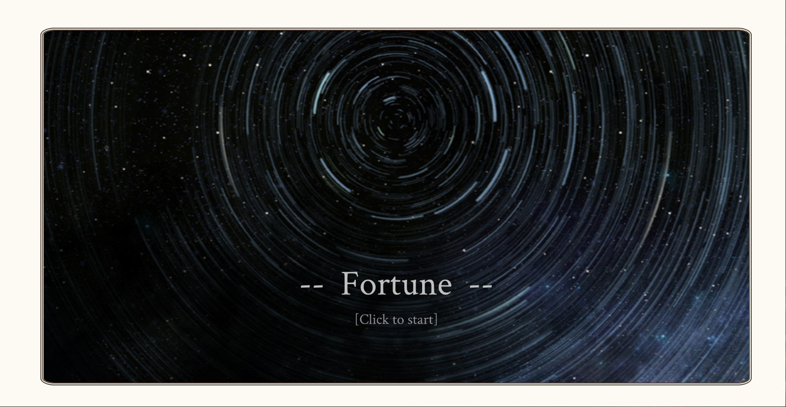
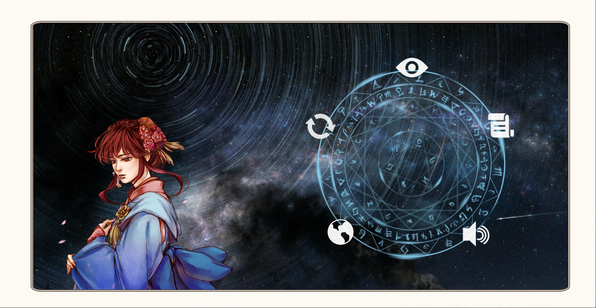
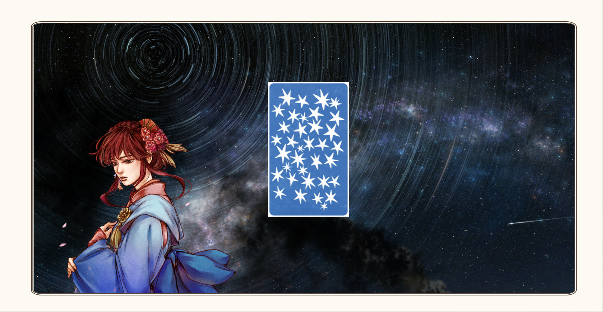
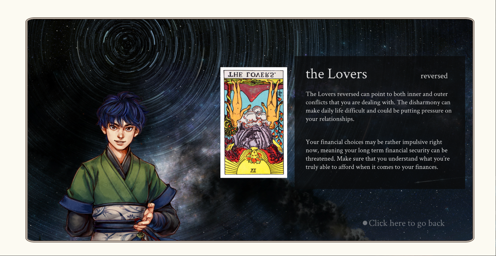

# The Way Home

[Link on Zeit](https://fortune.now.sh/)

## Description
   Fortune is a web-based interactive divination system, in which users can draw cards to get fortune-telling results. The project also adds diverse characters and stories to the divination process, which hopefully will provide unforgettable experiences for users. The ways of interaction include sound, music, card game. With multiple interactive functions, this project aims to engage users to the imagined world "the forgotten land".

## Creaters
   Sumner Feng

## Demos & Documentation
   [Video Documentation](https://youtu.be/dM7PHJfr27E)

## Guide
   

## Ciations
   
   #### -For Code-
   JS Library: [P5.js](https://p5js.org/)

   #### -For Art Source-
   The Character images: from [Tale of Wuxia: The Pre-Sequel](http://xkqz.fhyx.com/)

   The background images: from [Pixiv](https://www.pixiv.net)

   #### -For Sound Source-
   Background music from Sound of a Small Love & Chu-2 Byo Story

   

## Screenshots
   
   
   
   

## Update History
   2020.05.15: The first complete version

   2020.05.16: Added more card information, added a readme file and screenshots
   

